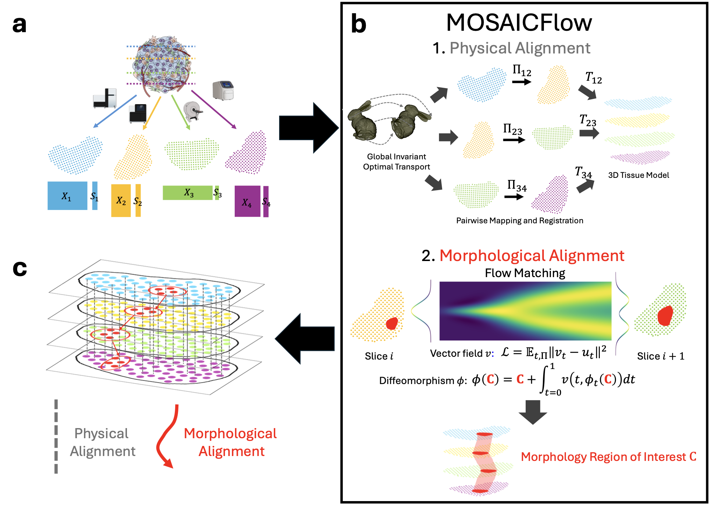

# PASTE2

This is the codebase for MOSAICFlow (MultimOdal Spatial Alignment and Integration with Conditional Flow matching), a computational method to perform physical and morphological alignment on spatial data with multimple modalities. 

There are two main functions:
1. `src/MOSAICFlow/physical/physical_align`: Given a pair of spatial slices, potentially from different modalities, performs physical alignment to affine register one slice onto the other, and compute a probabilistic mapping
2. `src/MOSAICFlow/morphological/morphological_align`: Give a pair of physically aligned slices and the probabilistic mapping, performs morphological alignment to learn a neural ODE between the two slices

## Note
This is a very preliminary version of the codebase to get you started on using our tool. We are actively working on the project and will include more functionalities soon.

## Contact
If you encounter any problem running the software, please contact Xinhao Liu at xl5434@princeton.edu or Hongyu Zheng at hz7140@princeton.edu.
